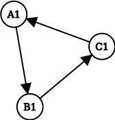

# Mini Spreadsheet

A lightweight spreadsheet application supporting basic calculations, functions, and cell references.

## Quick Start

### Try it online !!

You can try out Mini Spreadsheet online at: [https://dorukcem.itch.io/mini-spreadsheet](https://dorukcem.itch.io/mini-spreadsheet)

### Build and run it yourself

#### Prerequisites

- [Rust](https://www.rust-lang.org/tools/install)
- [Cargo](https://doc.rust-lang.org/cargo/getting-started/installation.html)
- [rustup](https://rustup.rs/)

#### Building from Source

1. Clone the repository.
2. Follow either the web or desktop build instructions below.


#### Web Version

```bash
# Install dependencies
cargo install basic-http-server
rustup target add wasm32-unknown-unknown

# Build and run
cargo build --release --target wasm32-unknown-unknown
cp target/wasm32-unknown-unknown/release/mini_spreadsheet.wasm .
basic-http-server .
```

#### Desktop Version

```bash
cargo run
```

## Usage Guide

### Basic Interface

- **Cell Editing**: Click any cell to edit its contents.
- **Cell References**: Hold Ctrl and click a cell to reference it in expressions (e.g., `A1`).
- **Content Overflow**: Hover over truncated cells to view full contents.
- **Error Handling**: Hover over errors for detailed descriptions.

### Data Types

| Type       | Description                         | Examples                |
| ---------- | ----------------------------------- | ----------------------- |
| Text       | Plain text strings                  | `Hello`, `World`        |
| Number     | Numeric values (integers or floats) | `42`, `3.14`, `1e-6`    |
| Boolean    | True/false values                   | `TRUE`, `FALSE`         |
| Expression | Formula starting with `=`           | `=A1+B1`, `=sum(A1:A4)` |

### Expression Syntax

- **Basic Operations**: Support standard mathematical operators (`+`, `-`, `*`, `/`).
- **Text Literals**: Use double quotes (e.g., `="Hello"+"World"`).
- **Cell References**: Direct (e.g., `A1`) or ranges (e.g., `A1:A4`).
- **Range Limits**: Maximum 100 rows and columns.

### Built-in Functions

#### Mathematical Functions

- `sum(args...)`: Sum of numeric values.
- `product(args...)`: Product of numeric values.
- `average(args...)`: Arithmetic mean.
- `max(args...)`: Maximum value.
- `min(args...)`: Minimum value.
- `pow(base, exponent)`: Power calculation.
- `round(number)`: Round to nearest integer.

#### Utility Functions

- `count(args...)`: Count numeric values.
- `length(text)`: String length.
- `if(condition, true_value, false_value)`: Conditional logic.

#### Function Usage Examples

```xls
= sum(A1:A4)           
= average(1, 2, A1)    
= if(A1>10, "High", "Low")  
```

## How it works
### Parsing cells

A cell with an input string is first [parsed](https://en.wikipedia.org/wiki/Parsing) by [tokenizing](https://en.wikipedia.org/wiki/Lexical_analysis) it. For example, an expression such as `= sum(1,2)` would be converted into something like: `[function_name("sum"), left_paranthesis, number(1), comma, number(2), right_paranthesis]`. These tokens represent types within the program, making it possible to reason and work with them. Next, we construct an [Abstract Syntax Tree](https://en.wikipedia.org/wiki/Abstract_syntax_tree) (AST) to compute the final value of the expression.

Once the AST of a cell is computed, it is stored in memory for future use, allowing us to skip parsing when recomputation is needed. During this process, we also identify which cells are referenced, enabling the construction of the computation graph explained below.


### Computation Order

Determining the order of computation is crucial. For example, consider a scenario where cell B1 contains an expression such as `= A1 + 2`. To compute the value of B1, the value of A1 must be available first. Therefore, the computation of A1 must precede that of B. Furthermore, if the value of A1 changes, its dependents (in this case B1) must be updated accordingly.

To manage these dependencies, we construct a [directed graph](https://en.wikipedia.org/wiki/Directed_graph) representing which nodes (cells) enable the computation of others.

Whenever a cell is added, removed, or modified, the graph must be updated to reflect the change. For instance, if cell A2 is added and references B1, this indicates that B1 is required to compute A2. In the graph, this relationship is represented by adding a directed edge from B1 to A2.  

  

In this example, it is evident that starting the computation from cell C1 avoids any reference errors. While it may be straightforward to determine the starting point and propagation of computation in small graphs, handling larger and more complex graphs requires a systematic approach. Specifically, we need an algorithm to determine the computation order in a generic directed graph. To achieve this, we perform a [topological sort](https://en.wikipedia.org/wiki/Topological_sorting) of the graph. Once sorted, we compute all cells in the determined order.

Additionally, as shown in the example, if the value of B1 changes, we must recompute both A3 and A2 to reflect the updated value of B1.
---

### Cyclic References

In some scenarios, it may be impossible to construct an [acyclic graph](https://en.wikipedia.org/wiki/Directed_acyclic_graph).  

  

When a cycle is present, it becomes impossible to compute a final result for the cells involved in the cycle, and an error must be returned. To avoid getting stuck in an infinite loop during computation, the topological sorting algorithm must be adapted to identify cells that form a cycle. These cells will be excluded from the computation process and flagged as part of a cycle.

