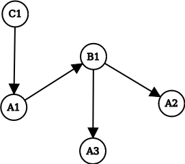

## How it Works

### Parsing Cells
When a cell is filled with an input string, we must [parse](https://en.wikipedia.org/wiki/Parsing) the string to make sense of it. To do this, we first break the string into tokens by [tokenizing](https://en.wikipedia.org/wiki/Lexical_analysis) it. For example, an expression such as `= sum(1,2)` would be converted into something like: `[function_name("sum"), l_paran, number(1), comma, number(2), r_paran]`. Unlike the input string, these tokens represent a type inside the program, which makes it possible to reason and work with them. Then, we must create an [Abstract Syntax Tree](https://en.wikipedia.org/wiki/Abstract_syntax_tree) to compute the final value of the expression.

Once we compute the AST of a cell, we keep it in memory for future use. This way, if a cell needs to be computed again, we can skip parsing it.

It must also be noted that while parsing a cell, we also determine which cells it references. We can then use this information to construct the computation graph, which will be explained below.

### Computation Order
It is important to determine the order of computation. For example, let’s say that cell B has an expression in it, such as `= A1 + 2`. It is clear that we need the value of A1 to compute B. Therefore, the computation of A1 *must* come before the computation of B. This also means that if, for any reason, the value of A1 changes later on, we must update its dependents accordingly (in this case, B). To achieve this, we need to construct a [directed graph](https://en.wikipedia.org/wiki/Directed_graph) where we can see which nodes allow the computation of others.

Any time a cell is added, removed, or mutated in the application, we must update the graph. For example, if cell A2 is added with a reference to B1, that means that B1 allows the computation of A2. Therefore, we must add an edge going from B1 to A2.  

In this example, we can clearly see that if we start the computation from cell C1, we will not encounter any reference errors. While it is somewhat easy to determine where computation should start and how it should propagate in small graphs, we need an algorithm to figure out the computation order in a generic directed graph. For that, we will need to [topologically sort the graph](https://en.wikipedia.org/wiki/Topological_sorting). Once we have the topological sorting of the graph, we can compute all cells in the order of that sorting.

We can also see in the example that if B1 changes, we must re-compute A3 and A2 according to the new value of B1.

### Cyclic References

There are some cases where we cannot achieve an [acyclic graph](https://en.wikipedia.org/wiki/Directed_acyclic_graph). In these cases, it is impossible to get a final result for the cells that form a cycle, and we must return an error instead. However, we do not want to get stuck in an infinite loop while computing the cells. To prevent this, we must [tweak](https://stackoverflow.com/questions/67644378/detecting-cycles-in-topological-sort-using-kahns-algorithm-in-degree-out-deg) the algorithm used for topological sorting to also return the cells that form a cycle. These cells will be excluded from the computation loop and marked as having a cycle.

